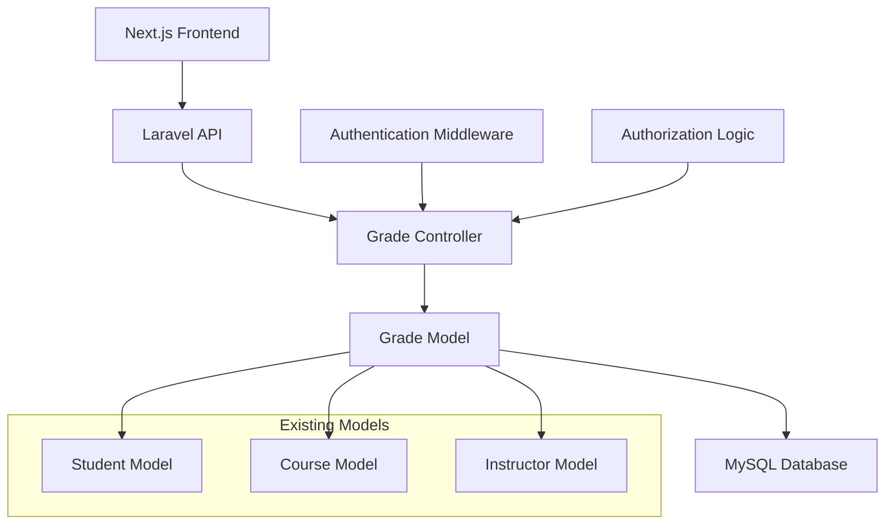
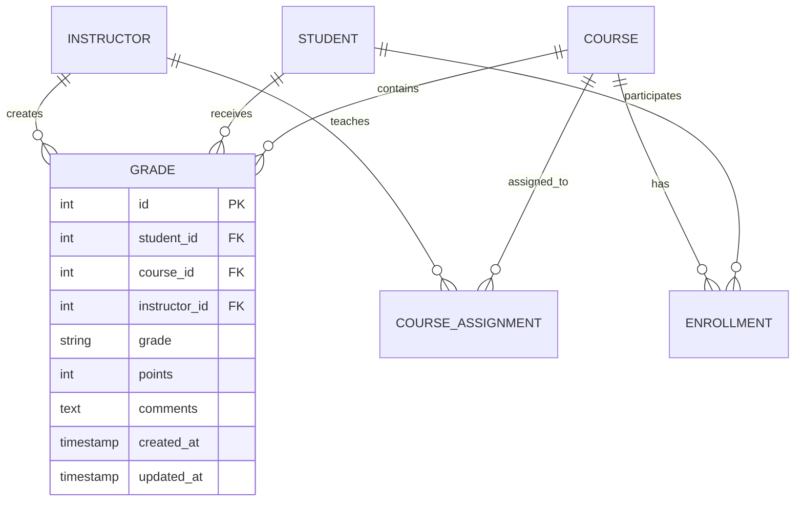

# Design Document: Instructor Grade Management

## Overview

The instructor grade management system provides a secure, role-based interface for instructors to manage student grades within their assigned courses. The system follows a clear 7-step workflow: authentication, course selection, student roster display, grade entry, save operation, database persistence, and student read-only access.

The design leverages the existing Laravel backend infrastructure with Grade model and GradeController, while integrating with the Next.js frontend. The primary focus is implementing the missing `courseGrades` method and ensuring proper validation and authorization throughout the grade management process.

## Architecture

The system follows a three-tier architecture:

**Presentation Layer (Next.js Frontend)**
- Instructor grade management interface
- Student grade viewing interface
- Authentication and session management
- Form validation and user feedback

**Application Layer (Laravel Backend)**
- GradeController with courseGrades method
- Authentication and authorization middleware
- Business logic for grade validation
- API endpoints for grade operations

**Data Layer (MySQL Database)**
- Grade model with existing relationships
- Student, Course, and Instructor models
- Database constraints and validation



## Components and Interfaces

### GradeController Enhancement

The existing GradeController requires the addition of the `courseGrades` method:

```php
public function courseGrades(Request $request, $courseId)
{
    // Validate instructor authorization for course
    // Retrieve all students enrolled in course
    // Get existing grades for course-student combinations
    // Return formatted response for frontend
}
```

### API Endpoints

**Existing Endpoints:**
- `POST /instructor/grades` - Create new grade
- `PUT /instructor/grades/{id}` - Update existing grade
- `GET /instructor/courses/{courseId}/grades` - **Missing implementation**

**New Implementation Required:**
- `GET /instructor/courses/{courseId}/grades` - Retrieve all grades for course

### Data Models

**Grade Model (Existing)**
```php
class Grade extends Model
{
    protected $fillable = ['student_id', 'course_id', 'instructor_id', 'grade'];
    
    public function student() { return $this->belongsTo(Student::class); }
    public function course() { return $this->belongsTo(Course::class); }
    public function instructor() { return $this->belongsTo(Instructor::class); }
}
```

**Expected Response Format:**
```json
{
    "course": {
        "id": 1,
        "name": "Course Name",
        "code": "CS101"
    },
    "students": [
        {
            "id": 1,
            "name": "Student Name",
            "email": "student@example.com",
            "grade": {
                "id": 1,
                "grade": "A",
                "points": 95,
                "comments": "Excellent work"
            }
        }
    ]
}
```

### Frontend Integration

**Instructor Interface:**
- Course selection dropdown populated from instructor's assigned courses
- Student roster table with grade entry fields
- Save/Submit button with validation feedback
- Success/error message display

**Student Interface:**
- Read-only grade display
- Course-specific grade filtering
- Grade history and details

## Data Models

### Grade Management Workflow

The system manages grades through a structured data flow:

1. **Course Authorization**: Verify instructor has permission for selected course
2. **Student Enrollment**: Retrieve all students registered for the course
3. **Grade Retrieval**: Fetch existing grades for course-student combinations
4. **Grade Validation**: Ensure grade values meet course requirements
5. **Data Persistence**: Store validated grades with proper relationships
6. **Response Formatting**: Return data in frontend-expected format

### Validation Rules

**Grade Validation:**
- Required fields: student_id, course_id, instructor_id, grade
- Grade format: Configurable (numerical 0-100, letter A-F, or custom scale)
- Instructor authorization: Must be assigned to the course
- Student enrollment: Must be registered for the course

**Security Constraints:**
- Instructors can only access grades for their assigned courses
- Students can only view their own grades
- All grade modifications require authenticated sessions
- Audit logging for grade changes

### Database Relationships



## Correctness Properties

*A property is a characteristic or behavior that should hold true across all valid executions of a system—essentially, a formal statement about what the system should do. Properties serve as the bridge between human-readable specifications and machine-verifiable correctness guarantees.*

### Property 1: Authentication Verification
*For any* user attempting to access grade functionality, the system should verify their credentials and only grant access to authenticated users
**Validates: Requirements 1.1, 6.1**

### Property 2: Instructor Course Authorization
*For any* instructor and course combination, the instructor should only be able to access grade data for courses they are assigned to teach
**Validates: Requirements 1.2, 1.4, 6.2, 7.3**

### Property 3: Course Student Retrieval Completeness
*For any* course selection by an authorized instructor, the system should return all students enrolled in that course without omission
**Validates: Requirements 1.3, 2.1**

### Property 4: Response Data Completeness
*For any* grade management response, all required fields (student information, grade data, course details) should be present and properly formatted
**Validates: Requirements 2.2, 4.5, 5.3**

### Property 5: Student Roster Ordering Consistency
*For any* course, multiple requests for the student roster should return students in the same consistent order
**Validates: Requirements 2.3**

### Property 6: Grade Validation Enforcement
*For any* grade input, the system should validate format and range according to course configuration and reject invalid values
**Validates: Requirements 3.1, 3.4**

### Property 7: Valid Grade Acceptance
*For any* valid grade input, the system should accept and prepare it for storage without rejection
**Validates: Requirements 3.2**

### Property 8: Grade Update Data Integrity
*For any* existing grade modification, the update should preserve data integrity and maintain proper relationships
**Validates: Requirements 3.3**

### Property 9: Grade Format Support
*For any* course configuration, the system should properly handle both numerical and letter grade formats as specified
**Validates: Requirements 3.5**

### Property 10: Batch Grade Validation
*For any* collection of grades submitted for saving, all grades should be validated before any storage occurs
**Validates: Requirements 4.1**

### Property 11: Grade Storage Relationship Integrity
*For any* valid grade data, storage should maintain proper associations between student, course, and instructor entities
**Validates: Requirements 4.2**

### Property 12: Save Operation Confirmation
*For any* successful grade storage operation, the system should provide confirmation feedback to the instructor
**Validates: Requirements 4.3**

### Property 13: Batch Save Error Prevention
*For any* batch save operation containing invalid grades, the entire operation should be prevented and invalid entries highlighted
**Validates: Requirements 4.4**

### Property 14: Student Grade Access Isolation
*For any* student accessing their grades, only grades for courses in which they are enrolled should be visible
**Validates: Requirements 5.1, 6.3**

### Property 15: Student Read-Only Access
*For any* student interface interaction, grade modification capabilities should be disabled and unavailable
**Validates: Requirements 5.2**

### Property 16: Audit Logging Completeness
*For any* grade modification operation, the system should create complete audit log entries for tracking purposes
**Validates: Requirements 6.4**

### Property 17: Security Violation Handling
*For any* unauthorized access attempt, the system should deny access and log the security violation appropriately
**Validates: Requirements 6.5**

### Property 18: CourseGrades API Functionality
*For any* valid courseGrades API request, the system should return complete grade data for all students in the specified course
**Validates: Requirements 7.1, 7.2**

### Property 19: API Response Format Consistency
*For any* API response, the data structure should match the format expected by the frontend interface
**Validates: Requirements 7.4**

### Property 20: API Error Response Standards
*For any* API error condition, the system should return appropriate HTTP status codes and descriptive error messages
**Validates: Requirements 7.5**

## Error Handling

The system implements comprehensive error handling across all layers:

**Authentication Errors:**
- Invalid credentials: Return 401 Unauthorized with clear message
- Session expiration: Return 401 with redirect to login
- Missing authentication: Return 401 with authentication required message

**Authorization Errors:**
- Instructor accessing unassigned course: Return 403 Forbidden
- Student accessing other student's grades: Return 403 Forbidden
- Invalid role permissions: Return 403 with role-specific message

**Validation Errors:**
- Invalid grade format: Return 422 with field-specific validation messages
- Missing required fields: Return 422 with list of missing fields
- Grade range violations: Return 422 with acceptable range information

**Database Errors:**
- Connection failures: Return 500 with generic error message (log specific details)
- Constraint violations: Return 422 with user-friendly constraint explanation
- Transaction failures: Rollback changes and return 500 with retry suggestion

**API Errors:**
- Malformed requests: Return 400 Bad Request with format requirements
- Resource not found: Return 404 with specific resource identification
- Server errors: Return 500 with generic message and error tracking ID

## Testing Strategy

The testing approach combines unit tests for specific scenarios with property-based tests for comprehensive validation:

**Unit Testing Focus:**
- Specific workflow scenarios (7-step instructor workflow)
- Edge cases (empty rosters, no grades available)
- Integration points between frontend and backend
- Error condition handling and user feedback
- Authentication and authorization boundary conditions

**Property-Based Testing Focus:**
- Universal properties across all valid inputs using Laravel's testing framework
- Comprehensive input coverage through randomized test data
- Data integrity validation across all operations
- Security enforcement across all user roles and permissions
- API response consistency and format validation

**Property Test Configuration:**
- Minimum 100 iterations per property test for thorough coverage
- Each property test references its corresponding design document property
- Test tagging format: **Feature: instructor-grade-management, Property {number}: {property_text}**
- Use Laravel's factory system for generating realistic test data
- Implement custom generators for grade formats and user roles

**Test Data Strategy:**
- Generate realistic instructor, student, and course combinations
- Create varied grade formats (numerical, letter, custom scales)
- Test with different course enrollment sizes (empty, small, large)
- Include edge cases in property test generators
- Maintain referential integrity in generated test data

**Integration Testing:**
- End-to-end workflow validation from authentication to grade storage
- Frontend-backend API contract verification
- Database transaction integrity under concurrent access
- Session management and timeout handling
- Cross-browser compatibility for frontend components